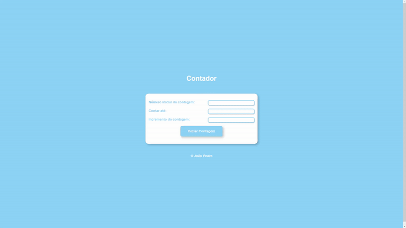
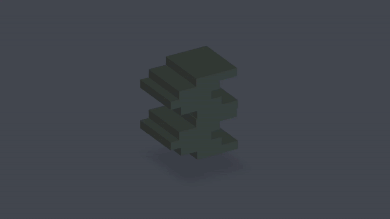
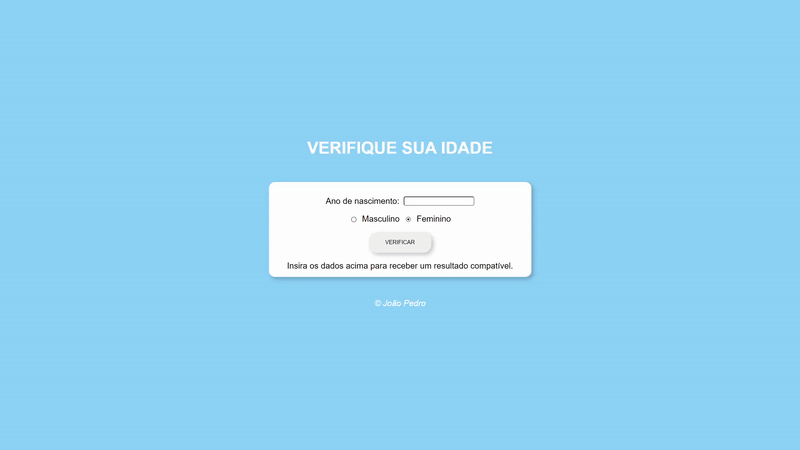
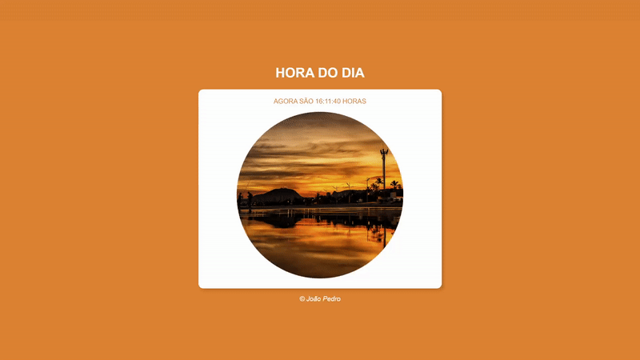
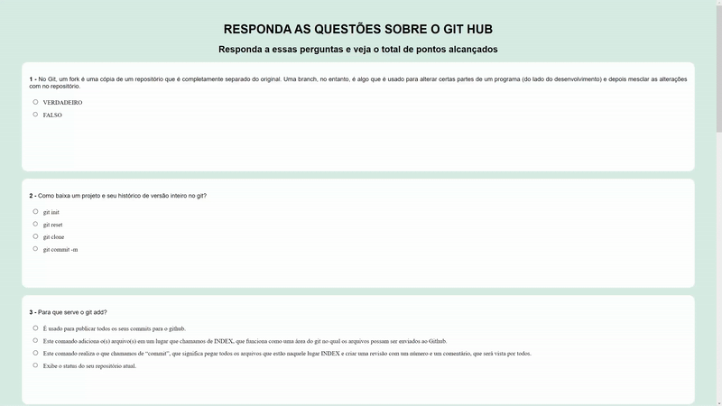
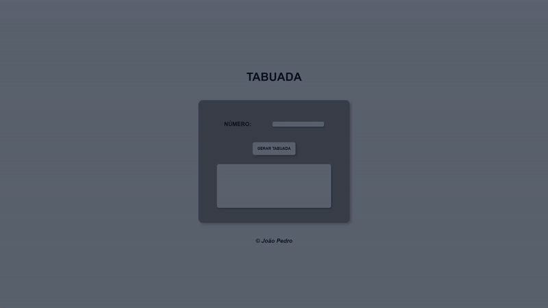

# :pencil2: Projetos Iniciais JavaScript, HTML e CSS

## Sobre o projeto

  Esse repositório tem como finalidade agrupar projetos desenvolvidos em HTML, CSS e JavaScript que possuem como objetivo aplicar conhecimentos nas três tecnologias,     desde lidar com datas até formulários.

### Contador

  

O projeto do contador envolve o usuário escolher um número inicial, um número final e a quantidade de incremento até chegar no número final. Foi utilizado a manipulação do DOM para realizar o projeto.

### Projeto 3D

  

Esse projeto busca simular um com HTML e CSS a visão isométrica muito utilizada em softwares de modelagem 3D para simular o efeito que o objeto em tera seja de fato  um mash em 3D.

### Seletor de Idade

  

Esse projeto busca lidar com datas e inputs em que o usuário possui uma interface que o mesmo escolhera o sexo e irá inserir o ano de nascimento e o script retornará uma foto escolhida de forma arbitrária e as cores da página baseado nos parâmtros que o usuário passou.

### Relogio

  

Esse projeto busca lidar com datas de forma dinâmica em que utiliza o Date nativo do JavaScript para alterar a data em tempo real na tela de forma que caso seja um determinado horário a estilização da página irá alterar para o horário indicado.

### Formulário

  

Esse projeto busca simular um formulário do google forms se utilizando apenas as tags HTML do HTML e a estilização do CSS. 

### Tabuada

  

Esse projeto utiliza de inputs do usuário para gerar uma tabuada do número inserido. 

## :desktop_computer: Tecnologias
As tecnologias utilizadas em todos os projetos foram
- <a href="https://developer.mozilla.org/en-US/docs/Web/HTML">HTML</a>
- <a href="https://developer.mozilla.org/en-US/docs/Web/CSS">CSS</a>
- <a href="https://developer.mozilla.org/en-US/docs/Web/JavaScript">JavaScript</a>

## Licença
Projetos feitos por <a href="https://www.linkedin.com/in/joao-pedro-silva-lopes/">João Pedro</a>

