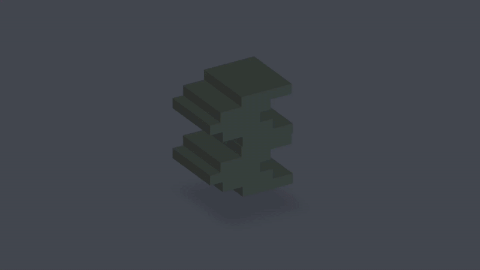
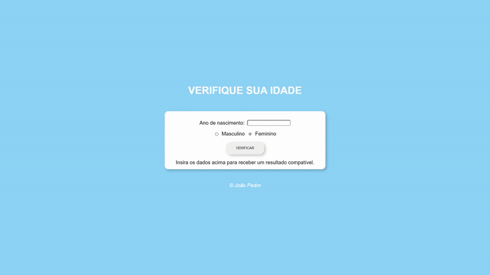
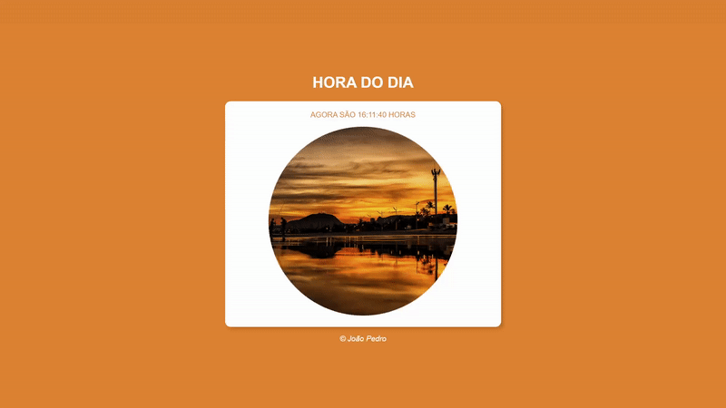

## :pencil2: Projetos Iniciais Web

## :file_folder: Sobre o projeto

  Esse repositório tem como finalidade agrupar projetos desenvolvidos em HTML, CSS e JavaScript que possuem como objetivo aplicar conhecimentos nas três tecnologias,     desde lidar com datas até formulários.

### Projeto Pokemon

  

Esse projeto busca recriar a dinâmica de escolha do pokémon inicial que acontece nos jogos da franquia, se preocupando e gerar um pokémon diferente devido à matemática de geração de IVs, Natures e os dados de cada espécie. 

Após a confirmação do pokémon escolhido o usuário será redirecionado para uma tela de pokedex feita com cards, em que cada card possui os dados do pokémon sendo isso para todos os primeiros 151 pokémons.

### Projeto Minecraft

  

Esse projeto é voltado para tentar recriar a pagina oficial do site do minecraft, se utilizando de conceitos básicos de CSS e HTML como Links entre páginas da web com href, tag iframe para video e estilização com background-repeat.

O usuário pode interagir com os botões em que os mesmos o redirecionam para páginas webs do próprios minecraft, sendo essas páginas tanto de notícias quanto de redes sociais como youtube, reddit e facebook ou até outros jogos da franquia. 

### Projeto 3D

  

Esse projeto busca simular um com HTML e CSS a visão isométrica muito utilizada em softwares de modelagem 3D para simular o efeito que o objeto em tera seja de fato  um mesh em 3D.

Foi utilizado marjoritariamente spans com index para fazer o efeito de raindow nos retangulos que formam o mesh.

### Seletor de Idade

  

Esse projeto busca lidar com datas e inputs em que o usuário possui uma interface que o mesmo escolhera o sexo e irá inserir o ano de nascimento e o script retornará uma foto escolhida de forma arbitrária e as cores da página baseado nos parâmtros que o usuário passou.

### Relogio do Dia

  

Esse projeto busca lidar com datas de forma dinâmica em que utiliza o Date nativo do JavaScript para alterar a data em tempo real na tela de forma que caso seja um determinado horário a estilização da página irá alterar para o horário indicado.

### Contador

  

O projeto do contador envolve o usuário escolher um número inicial, um número final e a quantidade de incremento até chegar no número final. Foi utilizado a manipulação do DOM para realizar o projeto.

### Tabuada

  

Esse projeto utiliza de inputs do usuário para gerar uma tabuada do número inserido. 

### Formulário

  

Esse projeto busca simular um formulário do google forms se utilizando apenas as tags HTML do HTML e a estilização do CSS. 

## :desktop_computer: Tecnologias

As tecnologias utilizadas em todos os projetos foram

- <a href="https://developer.mozilla.org/en-US/docs/Web/HTML">HTML</a>
- <a href="https://developer.mozilla.org/en-US/docs/Web/CSS">CSS</a>
- <a href="https://developer.mozilla.org/en-US/docs/Web/JavaScript">JavaScript</a>

## Licença

Projetos feitos por <a href="https://www.linkedin.com/in/joao-pedro-silva-lopes/">João Pedro</a>
